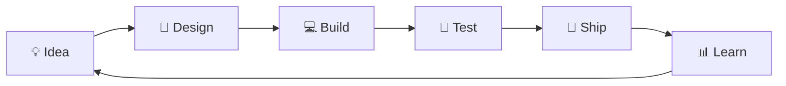

<div align="center">

<!-- ═══════════════════════════════════════════════════════════════ -->
<!-- PREMIUM ANIMATED HERO                                         -->
<!-- ═══════════════════════════════════════════════════════════════ -->


<a href="https://github.com/AanandAB">
  
</a>

<br/>


<br/>

<a href="#-what-im-building"></a>
<a href="#-contribution-universe"></a>
<a href="#-connect"></a>

<br/><br/>


</div>

---

## 👨‍💻 About Me

<table>
<tr>
<td width="60%">

### Hi! I'm Aanand 👋

I'm a **Salesforce Developer and Full-Stack Builder** from Kerala, India.

I enjoy creating things that combine:

⚡ **Clean user experiences**  
🧠 **AI-powered systems**  
📱 **Cross-platform applications**  
☁️ **Salesforce automation & integrations**  
🔗 **Web3 and decentralized applications**

Right now, I'm especially interested in building **AI agents and practical software products** that solve real problems.

<br/>

```text
💡 BUILD  →  🚀 SHIP  →  📈 LEARN  →  🔁 REPEAT
```

</td>
<td width="40%" align="center">


</td>
</tr>
</table>

---

## ⚡ My Tech Universe

<div align="center">

### 💻 Languages


<br/><br/>

### 🛠️ Frameworks & Platforms


<br/><br/>

### ☁️ Tools & Infrastructure


</div>

---

# 🚀 What I'm Building

<div align="center">


</div>

<br/>

<table>
<tr>
<td width="50%" valign="top">

### 🚚 OnamDelivery — "Swiggy for Flowers"

> **A flower-delivery marketplace for Kannur & Onam.**

A three-sided platform — customer app, delivery-partner fleet, and vendor + owner dashboards — on a Cloudflare-native backend.

**⚙️ Stack**

`Flutter` · `Cloudflare Workers` · `D1 + R2 + KV`

<a href="https://github.com/AanandAB/OnamDelivery"></a>

</td>
<td width="50%" valign="top">

### 🐠 Happy Aquarium

> **An immersive aquarium store + full custom CMS.**

A cinematic storefront for a Kerala aquarium store — 35+ fish species, compatibility checker, aquarium planner, and a role-based admin CMS.

**⚙️ Stack**

`Next.js (OpenNext)` · `Cloudflare D1` · `R2` · `GSAP`

<a href="https://github.com/AanandAB/aquarium"></a>

</td>
</tr>

<tr>
<td width="50%" valign="top">

### 🌸 Onapookkal

> **An Onam pookkalam designer.**

A festive flower-rangoli designer web app built for Onam, running on the edge.

**⚙️ Stack**

`Next.js` · `TypeScript` · `Cloudflare D1`

<a href="https://github.com/AanandAB/Onapoo"></a>

</td>
<td width="50%" valign="top">

### 📈 LeadtoClose

> **Compliance-aware freelance business manager.**

One app that takes a freelance project from first conversation to closed-won and paid — with Indian GST, DPDPA & legal compliance baked into a rules engine.

**⚙️ Stack**

`Flutter` · `Dart`

<a href="https://github.com/AanandAB/LeadtoClose"></a>

</td>
</tr>

<tr>
<td width="50%" valign="top">

### 🤖 Bytebot (AIOS)

> **A self-hosted AI desktop agent.**

Automates computer tasks through natural-language commands inside a containerized Linux desktop.

**⚙️ Stack**

`TypeScript` · `AI Agents` · `Docker`

<a href="https://github.com/AanandAB/AIOS"></a>

</td>
<td width="50%" valign="top">

### 🧁 Baby Bakers

> **A warm bakery site for a Kerala home baker.**

A clean, friendly storefront for a local bakery brand.

**⚙️ Stack**

`HTML` · `CSS` · `JavaScript`

<a href="https://github.com/AanandAB/babybakers"></a>

</td>
</tr>
</table>

<div align="center">

<a href="https://github.com/AanandAB?tab=repositories">

</a>

</div>

---

# 🌌 Contribution Universe

<div align="center">

### This is where the real story is written — one commit at a time.

<br/>

<!-- 3D CONTRIBUTION GRAPH -->


<br/><br/>

### 🐍 My contribution history, brought to life


</div>

<br/>

<div align="center">

### 🔥 Current GitHub Streak


</div>

---

## 📡 Developer Telemetry

<div align="center">


</div>

<br/>

<div align="center">

### 🏆 Achievement Cabinet


</div>

---

# 🧬 Latest GitHub Activity

<div align="center">

<!--START_SECTION:activity-->
<!--END_SECTION:activity-->

</div>

> This section can update automatically and show your latest pushes, pull requests, stars and repository activity.

---

## 🗺️ My Developer Journey

<div align="center">



</div>

---

# 🎯 Currently Exploring

<div align="center">


</div>

---

## 💬 Random Dev Wisdom

<div align="center">


</div>

---

# 🤝 Connect

<div align="center">

<a href="https://github.com/AanandAB">

</a>

<a href="https://linkedin.com/in/aanandab">

</a>

<a href="https://instagram.com/aanand_ab">

</a>

<br/><br/>


<br/><br/>


</div>
